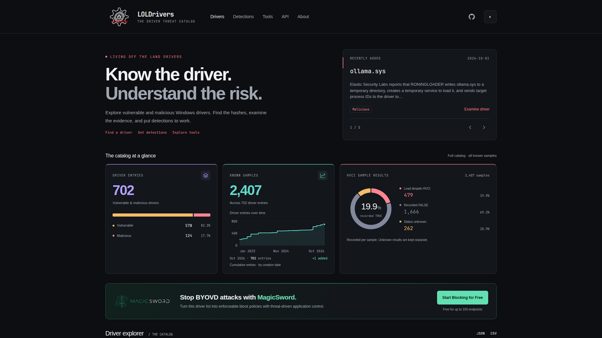

# LOLDrivers - Living Off The Land Drivers 🚗💨

 


Welcome to LOLDrivers (Living Off The Land Drivers), an exciting open-source project that brings together vulnerable, malicious, and known malicious Windows drivers in one comprehensive repository. Our mission is to empower organizations of all sizes with the knowledge and tools to understand and address driver-related security risks, making their systems safer and more reliable.

## Catalog at a Glance

The LOLDrivers catalog currently tracks **702 driver entries** (578 vulnerable, 124 malicious) with evidence from **2,407 known samples**. Each driver entry can have multiple known samples with different hashes, signatures, and HVCI results. The [live site](https://www.loldrivers.io/) shows real-time metrics, cumulative growth over time, and a searchable driver explorer.

## Key Features

- **Comprehensive driver catalog**: 702 driver entries covering vulnerable and malicious Windows drivers, with detailed metadata for 2,407 known samples
- **Astro-powered website**: Fast, modern site with searchable driver explorer, growth charts, and catalog metrics at [loldrivers.io](https://www.loldrivers.io/)
- **HVCI insights**: Sample-level evidence of load-despite-HVCI behavior, helping assess driver impact on hypervisor-protected code integrity
- **Structured API feeds**: Programmatic access via JSON and CSV endpoints at `/api/drivers.json` and `/api/drivers.csv` — see [API documentation](https://www.loldrivers.io/api/)
- **Detection resources**: Sigma, YARA, ClamAV (.hdb), Sysmon, and WDAC policies for proactive blocking and hunting
- **LLM-friendly**: Discoverable via `/llms.txt` with guidance for research, sample verification, and defensive integration
- **Continuously updated**: Community-maintained with the latest driver vulnerabilities, malicious samples, and research references

## How LOLDrivers Can Help Your Organization

- Enhance visibility into vulnerable drivers within your infrastructure, fostering a stronger security posture
- Stay ahead of the curve by being informed about the latest driver-related threats and vulnerabilities
- Swiftly identify and address risks associated with driver vulnerabilities, minimizing potential damages
- Leverage compatibility with Sigma to proactively block known malicious drivers by hash

## Getting Started

To begin your journey with LOLDrivers, simply check out the [LOLDrivers.io](https://loldrivers.io/) site or clone the repository and explore the wealth of information available in the categorized directories. We've designed the site to help you easily find the insights you need to protect your systems from vulnerable drivers.

To assist in speeding up the creating of a yaml file, check out [loldrivers.streamlit.app](https://loldrivers.streamlit.app)

## Support 📞

Please use the [GitHub issue tracker](https://github.com/magicsword-io/LOLDrivers/issues) to submit bugs or request features.

## 🤝 Contributing & Making PRs

Stay engaged with the LOLDrivers community by regularly checking for updates and contributing to the project. Your involvement will help ensure the project remains up-to-date and even more valuable to others.

Join us in our quest to create a safer and more secure digital environment for organizations everywhere. With LOLDrivers by your side, you'll be well-equipped to tackle driver-related security risks and confidently navigate the ever-evolving cyber landscape.

If you'd like to contribute, please follow these steps:

1. Fork the repository
2. Create a new branch for your changes
3. Make your changes and commit them to your branch
4. Push your changes to your fork
5. Open a Pull Request (PR) against the upstream repository

For more detailed instructions, please refer to the [CONTRIBUTING.md](CONTRIBUTING.md) file. To create a new YAML file for a driver, use the provided [YML-Template](YML-Template.yml).

## 🚨 Sigma, Yara, ClamAV and Sysmon Detection



LOLDrivers provides comprehensive Sigma, Yara, ClamAV and Sysmon detection rules to help you effectively detect potential threats. To explore these rules in detail, navigate to the [sigma](detections/sigma/), [yara](detections/yara), [av](https://github.com/magicsword-io/LOLDrivers/blob/main/detections/av/LOLDrivers.hdb) and [sysmon](detections/sysmon/) directories under the detection folder. Also there is [WDAC](detections/wdac/) policy thanks to [Florian Stosse](https://github.com/Harvester57) and [HotCakeX](https://github.com/HotCakeX).

Happy hunting! 🕵️‍♂️

## 🔎 Windows Folder Scanning

The community has also created a PowerShell LOLDriver scanner courtesy of [@Oddvarmoe](https://twitter.com/Oddvarmoe), [@M_haggis](https://twitter.com/M_haggis), and [IISResetMe](https://twitter.com/IISResetMe), that can help you identify potentially malicious drivers. The script, available [here](https://gist.github.com/IISResetMe/1a8353ae57710868b31b0e8d41683b95), allows you to scan a specified Windows folder for any suspicious files. We recommend running the script on directories such as:

```
C:\WINDOWS\inf
C:\WINDOWS\System32\drivers
C:\WINDOWS\System32\DriverStore\FileRepository
```

## 🏗️ Building and Testing Locally

The primary website uses **Astro** in [`website/`](website/README.md). See that guide for Node 24 / Python 3.11 setup, public API generation, local previews, and browser checks. Hugo and Go are no longer required to build or deploy the website.

The `Deploy Site` workflow validates production artifacts on pull requests and publishes the tested Astro artifact to GitHub Pages after a push to `main`. The separate preview workflow keeps analytics disabled. Tagged releases package driver downloads without deploying a website.

See the [production migration and rollback guide](docs/astro-migration.md) for the URL contract and remaining maintenance work.
